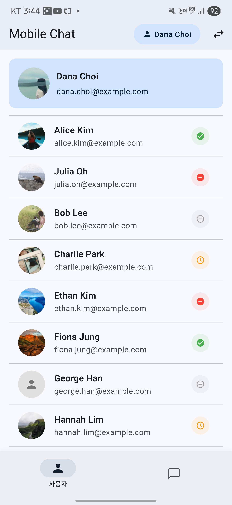
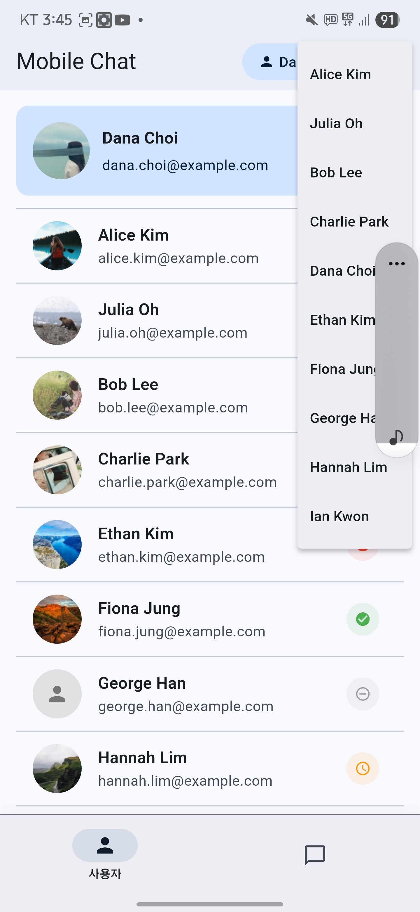
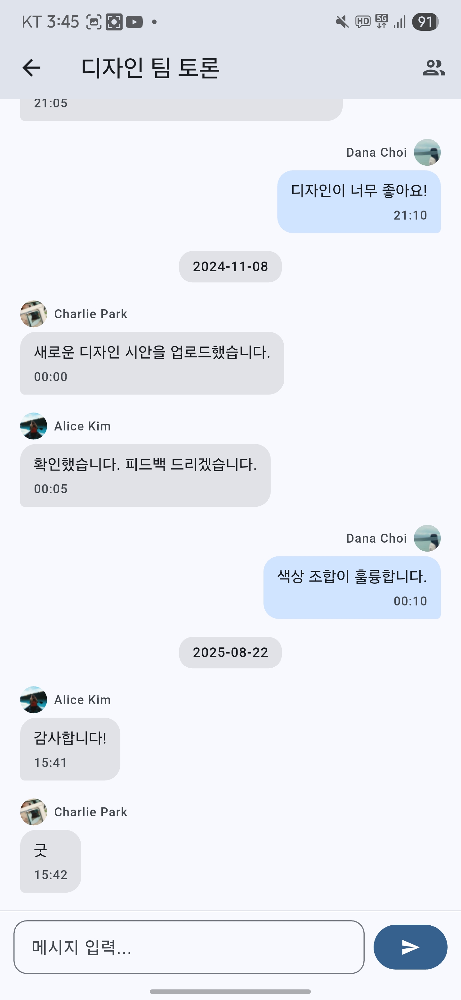
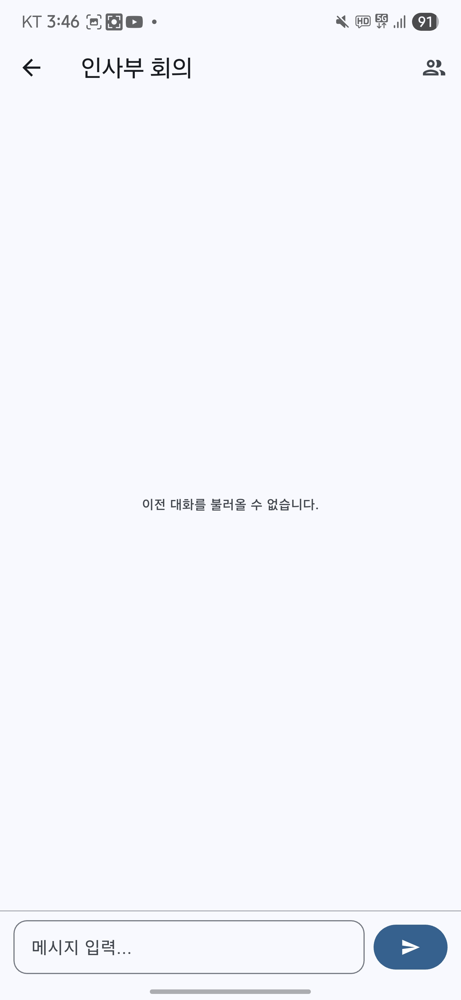
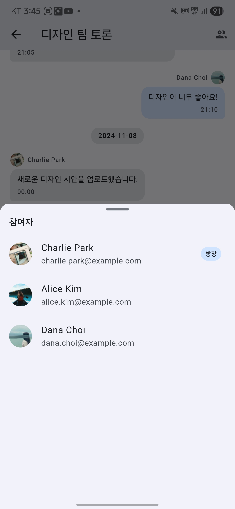
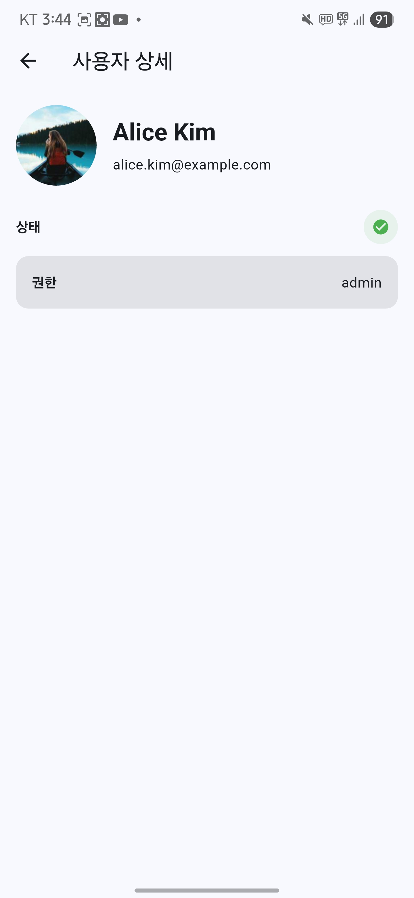
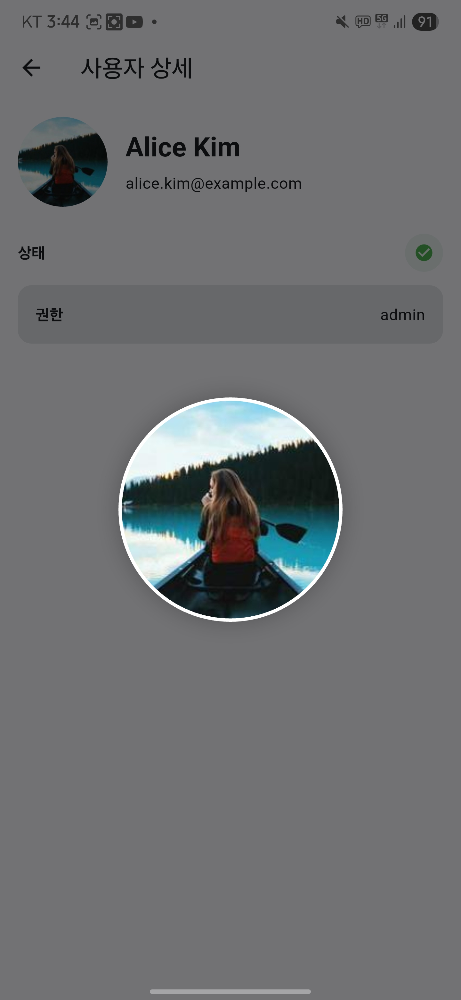

# RSUPPORT Mobile1 Flutter Developer Test

## 동작 영상
- 영상 링크: https://drive.google.com/file/d/18ZzAYdRE-DB2xu2RhXzg8FeoQZaMX8xA/view?usp=drive_link

## 스크린샷

### 홈/회의 목록 및 사용자 목록
- 회의 목록

- 회의 목록 안읽은 알림

- 사용자 목록

- 사용자 전환

### 채팅
- 채팅 화면 (메시지 내역)

- 채팅 화면 (이전 대화 없음 표시)

- 채팅 참여자 바텀시트

### 사용자 상세 및 프로필 확대
- 사용자 상세

- 프로필 이미지 확대

## 개발 환경
- Flutter: 3.35.1 (stable), Dart: 3.9.0, DevTools: 2.48.0
- macOS: 15.6 (24G84) darwin-arm64
- Xcode: 16.4 (Build 16F6), CocoaPods: 1.16.2
- Android SDK: 35.0.0 (Platform android-36, build-tools 35.0.0)
  - JDK: Android Studio bundled JBR 21.0.6
  - 참고: 일부 Android 라이선스 미승인 상태 → `flutter doctor --android-licenses` 필요
- Android Studio: 2025.1
- 연결 기기: SM S938N (Android 15), macOS, Chrome

## Flutter/라이브러리 버전
- Flutter SDK: 3.35.1
- flutter_bloc: ^9.1.1
- go_router: ^16.2.0
- dio: ^5.7.0
- get_it: ^8.2.0
- freezed / json_serializable / build_runner
- hive_flutter: ^1.1.0
- cached_network_image: ^3.4.1

예외 사유
- flutter_lints: ^6.0.0 (Flutter 3.9/3.35 계열과 호환되는 최신 린트)
- build_runner 계열: 최신 메이저 대비 검증된 조합 사용(생성 안정성 우선)

## 구현 스토리라인
1) 퍼스트 런(First Run)
- 앱 시작 시 `StartupCubit`이 초기화 → DI 컨테이너(setupDependencies) 구성, 로컬 스토리지(Hive) 오픈
- 최초 실행 여부/캐시 유무를 확인하여 초기 라우팅 상태 준비

2) 데이터 시드 및 선 테스트(API 선 검증)
- 제공 JSON(API) 엔드포인트를 `network_data_source`로 사전 호출하여 스키마와 필드 무결성 검증
- 네트워크 실패 대비 로컬 `local_data_source`(assets)로 폴백 시나리오 점검

3) 사용자/회의 데이터 로드
- `UsersBloc`, `RoomsBloc`이 병렬로 로드 이벤트 실행 → repository가 네트워크 우선, 실패 시 로컬로 폴백
- 성공 시 상태에 캐시된 리스트 반영, 실패 시 에러 상태와 UI 피드백 제공

4) 채팅 흐름
- 회의실 선택 → `ChatBloc`가 해당 roomId 로드, 메시지 스트림/로컬 저장 연동
- 전송 시 즉시 UI 반영 후 로컬 저장 → 재시작/재진입 시 동일 상태 재현

5) 사용자 전환
- `HomeBloc`에서 현재 사용자 세션 관리 → 전환 시 `UsersBloc/RoomsBloc` 동기 업데이트

## 구현 중점 사항 (API 선 테스트 · 네트워크/로컬 데이터 활용)
- 데이터 소스 우선순위: Network → Local(폴백) → Cache 재사용
- API 스키마 사전 점검: 필수 필드 존재/타입 검증, 예외 필드 safe parsing(json_serializable)
- 실패 격리: repository 레벨에서 예외 매핑 → Bloc 상태로 전달하여 UI에서 일관 처리

## 퍼스트런 · Storage 전략
- Storage: Hive(box per domain)로 경량 영구 저장. 메시지는 시간순 인덱싱, 룸/유저는 ID 키-값 저장
- 캐싱 키 설계: `messages:{roomId}`, `rooms:list`, `users:list`
- 무결성 정책: 네트워크 성공 시 캐시 갱신, 실패 시 캐시 서빙. TTL 대신 명시적 갱신 트리거(재진입/풀투리프레시) 채택
- 마이그레이션 대비: 박스 버전 분리 가능하도록 repository 계층을 경유해 접근 캡슐화

## BLoC Structure 설계 및 프로젝트 쟁점
- Bloc 경계
  - `StartupCubit`: 초기화/DI/스토리지 오픈
  - `HomeBloc`: 현재 사용자 세션 소스 오브 트루스 → 하위 `UsersBloc/RoomsBloc`로 브로드캐스트
  - `UsersBloc`: 목록/현재 사용자 표시 상태, 에러/로딩 분기 단순화
  - `RoomsBloc`: 방 목록, 미읽음 카운트 맵, 현재 사용자 변경 시 재계산
  - `ChatBloc`: 메시지 스트림/전송/스크롤 보정(하단 고정, 키보드 변화 대응)
- 이벤트/상태 최소화 원칙: 화면 목적에 필요한 필드만 유지, 가공 데이터는 selector에서 계산
- 쟁점 1 – 스크롤 UX: 신메시지 도착/전송 시 하단 고정과 과도한 점프 방지 
- 쟁점 2 – 읽음 처리: 사용자 기준 마지막 가시 인덱스와 타임스탬프 기반으로 룸별 미읽음 카운트 계산
- 쟁점 3 – 데이터 일관성: 사용자 전환 시 병렬 Bloc 동기화 순서 보장 → `HomeBloc` → `UsersBloc/RoomsBloc` 순으로 이벤트 분배
- 쟁점 4 – 이미지 네트워크 부담: `cached_network_image` 전면 적용(아바타/룸 썸네일/프로필 확대), 메모리 캐시 크기 제어
- 쟁점 5 – 오프라인 대비: 로컬(assets/Hive) 폴백 경로 확립, 에러 UI 명시화(로딩/에러/빈 상태)

## 사용자 스토리 충족 현황
- [x] 최초 화면: 사용자 목록
- [x] 하단 탭으로 사용자/회의 전환
- [x] 사용자 터치 시 상세 보기
- [x] 회의 터치 시 채팅 이동
- [x] 메시지 입력/전송 및 로컬 저장 반영
- [x] 메시지, 방(최근 메시지 기준) 정렬

## 추가 구현
- [x] 현재 사용자 전환 드롭다운
- [x] 참여자 바텀시트
- [x] 캐시드 이미지(아바타/룸 썸네일/프로필 확대)
- [ ] △ 메시지 수정/삭제 -> repo만 구현, ui기능 미구현

---
작성자 GitHub: https://github.com/Julong01
