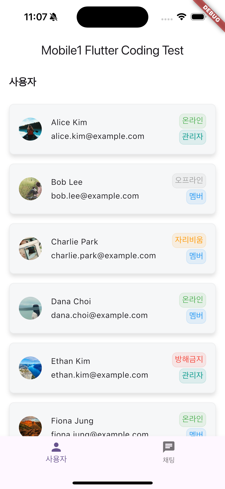
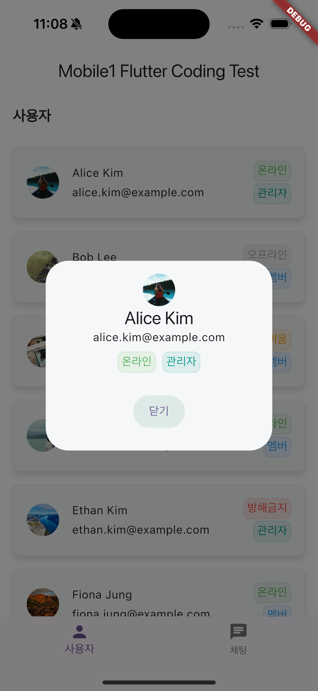
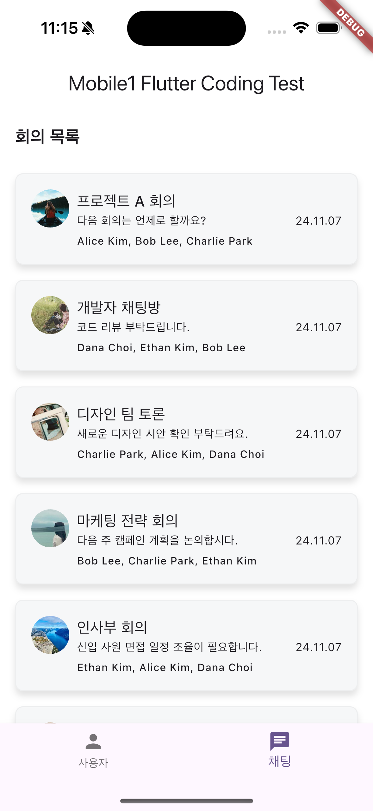
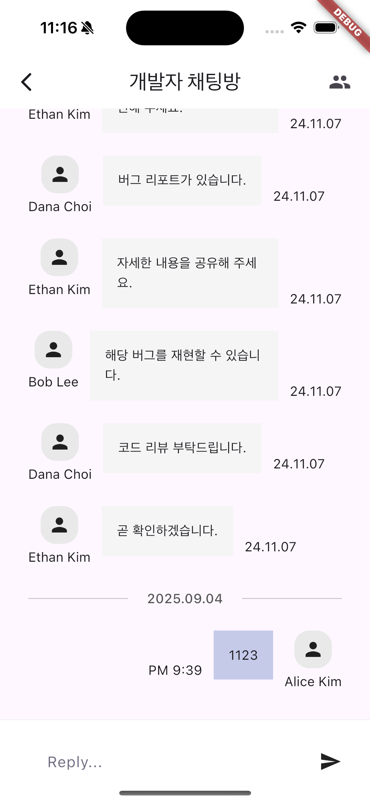
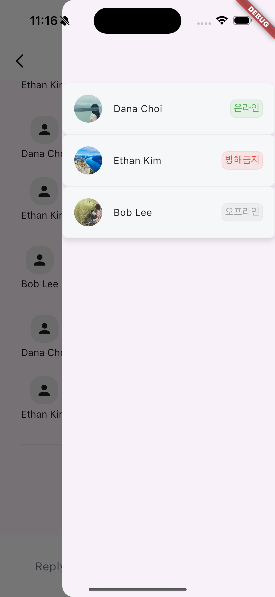
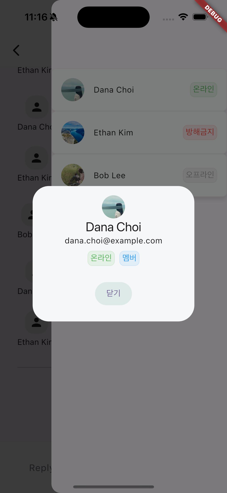

# 구현 중점 사항

1. MVVM 패턴을 적용
2. riverpod을 사용한 상태관리
3. Hive 패키지를 이용해 메세지 데이터 저장
4. 제공된 API를 네트워크를 통해 데이터 연동
5. 단위 테스트 코드 작성

# 동작영상

https://drive.google.com/file/d/1pONogpM9uS7zVkwbB_Iqu1Jrk95e6Y4U/view?usp=drive_link

# 스크린샷

- 사용자 목록
  

- 사용자 상세 정보
  

- 회의 목록
  

- 채팅방
  

- 채팅방 참여자 목록
  

- 채팅방 참여자 목록에 참여자 정보 상세 보기
  
